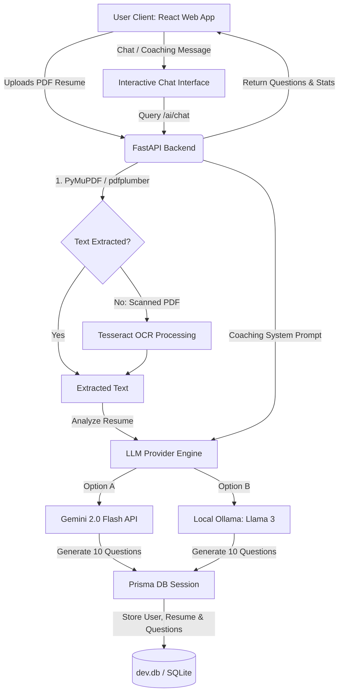

# AI-Powered Interview Assistant

An intelligent, full-stack web application designed to help job candidates prepare for technical interviews. The platform allows users to upload their resumes in PDF format, parses the text using a hybrid OCR pipeline, and generates custom-tailored technical questions using Google Gemini (or local Ollama). It also includes an interactive AI Interview Coach chatbot to simulate technical discussions and preparation.

---

## 🏗️ Architecture & System Flow



---

## 🛠️ Technology Stack

| Component | Technology | Description |
| :--- | :--- | :--- |
| **Backend Framework** | [FastAPI](https://fastapi.tiangolo.com/) | High-performance Python web framework for building APIs. |
| **Frontend UI** | [React](https://react.dev/) + [Vite](https://vite.dev/) | Ultra-fast development server and modern UI architecture. |
| **Styling** | [Tailwind CSS](https://tailwindcss.com/) | Utility-first CSS framework for clean, custom designs. |
| **Animations** | [Framer Motion](https://www.framer.com/motion/) | Smooth layout transitions and interactive UI effects. |
| **Database ORM** | [Prisma Python Client](https://prisma-client-py.readthedocs.io/) | Auto-generated, fully type-safe query builder for Python. |
| **Database** | SQLite (Default) | Embedded database engine (`dev.db`). Compatible with PostgreSQL. |
| **Text Extraction** | PyMuPDF, pdfplumber, Pytesseract | Hybrid OCR/PDF parser pipeline for structured or scanned documents. |
| **AI / LLM Orchestration** | Gemini 2.0 Flash API / Ollama | Dual integration support for state-of-the-art API or local LLM processing. |

---

## 📂 Project Structure

```text
ai-interview-assistant-main/
├── app/                      # FastAPI Python Backend
│   ├── api/                  # API Endpoints
│   │   └── v1/
│   │       └── endpoints/    # resume.py (upload), auth.py (auth), ai.py (chat)
│   ├── core/                 # App config & environment configuration
│   ├── db/                   # Database session initialization
│   ├── models/               # Pydantic schemas and database models
│   ├── services/             # Core logic services (OCR, AI providers, interview services)
│   ├── uploads/              # Temporary upload directory for PDFs
│   └── main.py               # FastAPI server startup and middleware registration
├── databases/                # Database backups and schema storage
│   └── project_backup.sql    # Relational database fallback backup SQL
├── frontend/                 # React + TypeScript Web Application
│   ├── src/
│   │   ├── components/       # Reusable components (AIChat, UploadDropzone, Navbar, etc.)
│   │   ├── layouts/          # Page layouts (DashboardLayout)
│   │   ├── pages/            # Login, Register, Dashboard, Upload pages
│   │   ├── services/         # API fetch calls (api.ts)
│   │   └── App.tsx           # Route registrations (React Router Dom v7)
│   ├── tailwind.config.js    # Tailwind layout settings
│   └── vite.config.ts        # Vite configuration
├── .env                      # Global environment settings (API keys & DB urls)
├── requirements.txt          # Python dependency list
├── schema.prisma             # Prisma database schema definition
└── test_randomness.py        # Independent testing script for AI response evaluation
```

---

## 🗄️ Database Schema

The database relies on a clean relational layout defined in [schema.prisma](file:///d:/All/system-files/Projects/ai-interview-assistant-main/schema.prisma):

*   **User**: Handles candidate authentication details.
*   **Resume**: Tracks the path of uploaded PDF files, raw text extracts, and metadata JSON results.
*   **InterviewQuestion**: Relational model containing the 10 custom AI-generated questions mapped to specific resumes.
*   **Skill**: Auto-extracted technical skills matched with confidence levels (0.0 to 1.0).

---

## 🚀 Getting Started

### 📋 Prerequisites

*   Python 3.10 or higher
*   Node.js 18 or higher (with `npm`)
*   *(Optional)* Tesseract OCR engine installed on your system if parsing scanned PDFs.

---

### 1️⃣ Backend Setup & Installation

1.  **Navigate to the project root:**
    ```powershell
    cd ai-interview-assistant-main
    ```

2.  **Create and activate a virtual environment:**
    ```powershell
    python -m venv venv
    # On Windows (PowerShell)
    .\venv\Scripts\Activate.ps1
    # On macOS/Linux
    source venv/bin/activate
    ```

3.  **Install dependencies:**
    ```powershell
    pip install -r requirements.txt
    ```

4.  **Configure Environment Variables (`.env`):**
    Create a `.env` file in the root directory (or edit the existing one):
    ```env
    DATABASE_URL="file:./dev.db"
    LLM_PROVIDER="gemini"
    GEMINI_API_KEY="your-gemini-api-key-here"
    
    # Optional local Ollama configurations
    OLLAMA_URL="http://localhost:11434"
    OLLAMA_MODEL="llama3"
    ```

5.  **Generate and Sync the Prisma Client:**
    Generate python client classes and create the database schema locally:
    ```powershell
    prisma generate
    prisma db push
    ```

6.  **Run the Backend Server:**
    ```powershell
    uvicorn app.main:app --reload
    ```
    The API docs will be available at `http://127.0.0.1:8000/docs`.

---

### 2️⃣ Frontend Setup & Installation

1.  **Navigate to the frontend directory:**
    ```powershell
    cd frontend
    ```

2.  **Install frontend dependencies:**
    ```powershell
    npm install
    ```

3.  **Start the React Development Server:**
    ```powershell
    npm run dev
    ```
    Open the application at `http://localhost:5173`.

---

## 🧪 Testing & Utilities

### AI Response Evaluator (`test_randomness.py`)
To test the API integration and verify the quality and distribution of questions generated by the AI model:
```powershell
python test_randomness.py
```
This utility:
*   Generates a mock PDF resume (`demo_resume.pdf`) on-the-fly.
*   Triggers duplicate parallel runs to the Gemini API.
*   Calculates uniqueness metrics, showing overlap statistics to verify candidate evaluation variability.

---

## 💡 Usage Workflow

1.  **User Onboarding:** Create an account in the `/register` portal and log in to obtain a dummy JWT token.
2.  **Upload Resume:** Drag-and-drop a PDF resume into the Upload portal. The hybrid parser processes the document and feeds it to the LLM.
3.  **Explore Dashboard:** Review extracted details, statistics, and a listing of the generated 10 specialized technical questions.
4.  **AI Interview Coach:** Engage in a real-time conversational chat with the AI Coach to answer generated questions and receive feedback.
